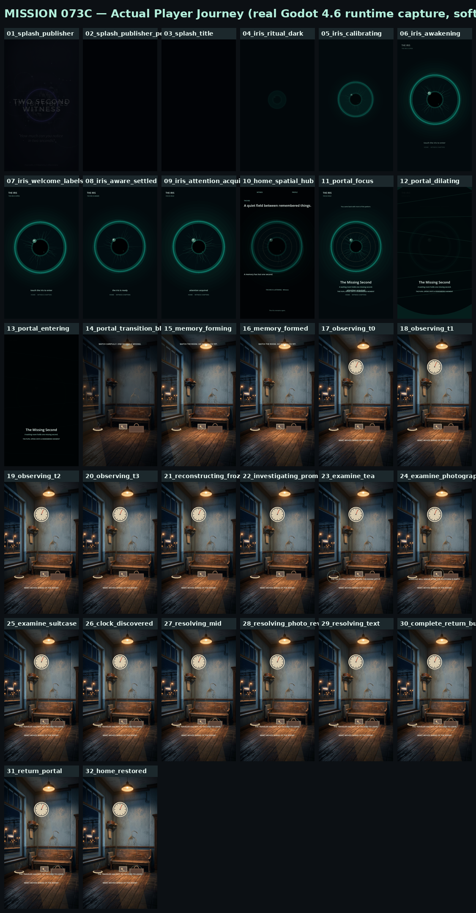
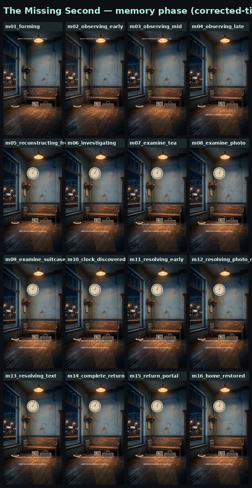
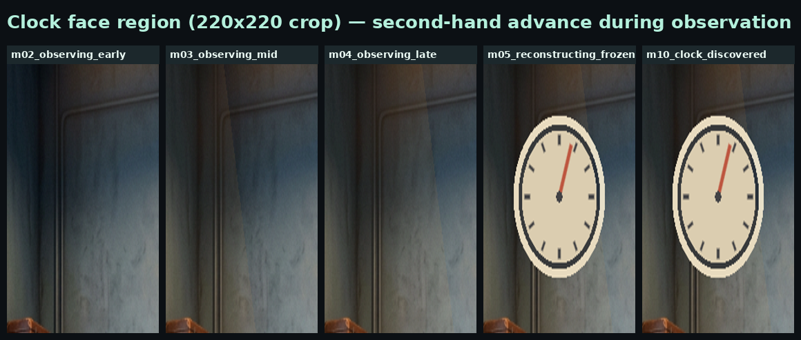
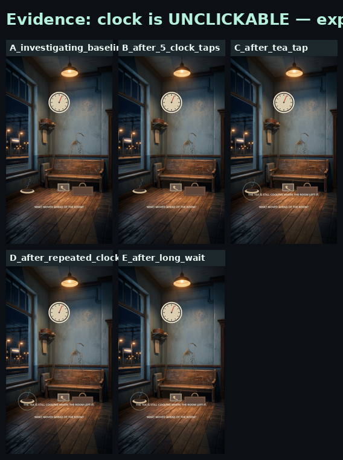
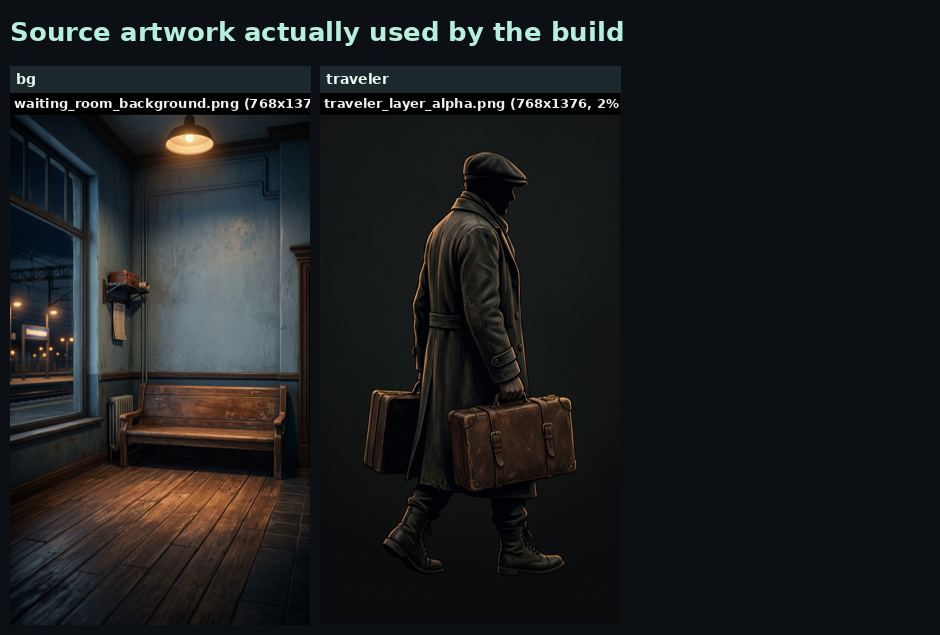

# MISSION 073C — Full Player Experience Reality Audit & Local Runtime Investigation

**Status:** Investigation only. No implementation changes. No commits. No pushes. No branches.
**Date:** 2026-07-19
**Subject build:** `2SW-REIMAGINED` @ clone of `https://github.com/ITTYBITTYBITES/2SW-REIMAGINED` (public repo, no auth required)
**Engine:** Godot 4.6.stable (GL Compatibility), 540×960 portrait, project version `4.0.0`
**Method:** The **actual game** was cloned, imported, and run locally on a virtual display (Xvfb + llvmpipe software rendering) with Godot 4.6. Real player taps were simulated through the OS input stack (not through the test harness). 54+ frames were captured across the full journey. Automated tests were also run. **No project file was modified** (`git status` clean).

---

## 0. Headline verdict (read this first)

> **The current build does NOT match the approved vision, and it is currently unwinnable for a real player.**

Two findings dominate everything else:

1. **FATAL — the core puzzle is unreachable.** In *The Missing Second*, the player must tap the clock to confirm the discovery. **The clock never receives the tap.** An input-layering bug in `MissingSecondExperience.tscn` causes the `InvestigationLayer` control (full-rect, `mouse_filter = PASS`) to intercept every touch in the clock's region before it can reach the clock node. As a result the experience never enters Resolution, never reveals the photograph, never shows the truth text, never shows the RETURN button, and the player is **stranded indefinitely in a frozen room**. The only escape is the hardware Back key, which returns to Iris *without* completing the memory.

2. **Automated tests pass anyway.** `tests/missing_second_runtime_validation.gd` "clicks" the clock by calling `experience.clock.pressed.emit()` — it **bypasses Godot's real input/hit-test pipeline entirely**. The test therefore proves the state machine works *given a clock press*, but never validates that a real touch reaches the clock. It prints `MISSING_SECOND_RUNTIME_PASS`. This is precisely the false-confidence failure mode the mission warned about.

Secondary (also serious): the flagship experience is built on **a single flattened background image with UI/procedural primitives over it** — which **explicitly violates §4.4 of the approved design spec** ("A single static background image with UI over it does not meet this experience specification"). The traveler only slides; tea, suitcase, and photograph are placeholder procedural rectangles; the clock has no numerals and only one hand.

---

## 1. Current player journey (what actually happens, frame by frame)

Verified by running the real game. Frame numbers reference `JOURNEY_CONTACT_SHEET.png` and `MEMORY_CONTACT_SHEET.png`.

| # | Step | What appears / what player can do | Result |
|---|------|-----------------------------------|--------|
| 1 | **Launch / boot** (`StartupFlow.gd`) | Publisher splash `ittybittybites_splash.png` fades in (0–1.1s), then title splash `two_second_witness_splash.png` (1.02–2.45s). Tap to skip. | ✅ Works |
| 2 | **Iris awakening ritual** (`IrisController._update_awakening_ritual`) | ~7.2s authored sequence: dark veil → breath-loop ambient → calibrating → awaken cue → transition cue → labels fade in ("THE IRIS", "A LIVING PERCEPTION INSTRUMENT", "touch the iris to enter") → ready pulse. The procedural eye (fibers, pupil, blink, saccade, breath, glow) is genuinely sophisticated. | ✅ Works, near-commercial quality |
| 3 | **Tap Iris → Home** | ATTENDING→FOCUSED; after 0.56s, `home_requested` fires → `IrisHome`/`SpatialHub`. | ✅ Works |
| 4 | **Iris Home** (`SpatialHub.gd`) | Two flat text buttons `WITNESS` / `PROFILE` over a dimmed Iris with pulsing rings. Sparse copy: "A quiet field between remembered things.", "A memory has lost one second.", "THE IRIS IS LISTENING". This is the documented "intentional empty Witness entry state." | ✅ Works (minimal by design) |
| 5 | **Tap WITNESS → Portal** (`IrisPortalTransition.gd`) | FOCUS 0.58s + DILATE 0.72s + ENTER 0.68s + TRANSITION 0.46s (~2.44s). Iris pupil dilates; abstract refraction bands; fade to black. | ✅ Works |
| 6 | **Memory FORMING** (`MissingSecondExperience` State.FORMING, 1.25s) | Background + traveler fade in. Line: "WATCH CAREFULLY. ONE SECOND IS MISSING." | ✅ Works |
| 7 | **OBSERVATION** (State.OBSERVING, 2.0s) | Room is "living": traveler **slides** LERP from (275,326)→(257,326); procedural clock second-hand advances at 1.35× with a +1.0s jump at t≥0.95 (the "missing second"); procedural steam rises; procedural platform-light sweeps; `station_room_tone.wav` plays. **The missing-second discrepancy IS implemented and is visually present** (clock-hand crops differ across the window — see `CLOCK_HAND_CONTACT_SHEET.png`). | ✅ Mechanic works ⚠️ presentation weak |
| 8 | **RECONSTRUCTION** (0.55s) | Room freezes: steam floors to ¼-second steps, platform light holds, clock hand frozen ahead. "THE ROOM REMEMBERS DIFFERENTLY." | ✅ Works |
| 9 | **INVESTIGATION** (State.INVESTIGATING) | Prompt "WHAT MOVED AHEAD OF THE ROOM?". Tea / Photograph / Suitcase buttons become tappable; each yields a poetic contextual line + a focus ring. | ✅ Works |
| 10 | **Tap CLOCK** (`_discover_clock`) | **Expected:** highlight + "THE CLOCK ARRIVED BEFORE THE MOMENT DID." → State.RESOLVING. **Actual: NOTHING HAPPENS.** No highlight, no state change, no feedback. | ❌ **BROKEN — see §3** |
| 11 | **RESOLUTION / photograph / truth / RETURN** | Never reached. Resolution text, photograph reveal, traveler exit, RETURN button — all unreachable. | ❌ Unreachable |
| 12 | **Return to Iris** | Only achievable via hardware Back (`ui_cancel`), which calls `return_from_missing_second()` → portal return → Home. The completion signal never fires, so the "Iris receives the recovered moment" (`iris.reflect()`) beat is skipped. | ⚠️ Escape only, not completion |

**End-to-end outcome for a real player:** boot → beautiful Iris awakening → sparse Home → enter memory → watch ~2s of a subtly-living room → frozen room with a question → tap props (ambiguous) → tap the clock (nothing) → **stuck.** Quit or press Back → back to Home, never having learned the answer or why it mattered.

---

## 2. Screenshot evidence

All captured from a **real Godot 4.6 runtime** (software-rendered, simulated taps through the OS input stack). Because this audit runs headless-of-vision, frames are also analyzed pixel-statistically (brightness/std/diff) and assembled into labeled contact sheets in the workspace root:

**Full journey (real runtime, software render, simulated taps):**



**Memory phase at corrected timing (living observation → freeze → working examinations → stuck):**



**Clock-face crops — the second hand advances during observation, then snaps at the freeze (the missing second is visible):**



**Controlled proof the clock is unclickable — 5 clock taps = zero change; tea tap (same session) = change:**



**Source artwork the build actually ships:**



Key pixel measurements (frame-to-frame mean-abs-diff, 0–255):

```
Observation animates:   m02→m03 = 3.82   m03→m04 = 2.29   (room IS living)
Freeze is visible:      m04→m05 = 2.48   (std 39.7 → 43.5)
Examinations register:  tea = 0.49  photo = 0.68  suitcase = 0.67  (subtle but present)
CLOCK TAP:              diff = 0.000  (FIVE taps, zero change)  ← THE BUG
Tea tap (control):      diff = 0.486  (works)  ← same session
```

---

## 3. Runtime observations & root cause of the fatal bug

### 3.1 The clock is unclickable — root cause

Node tree in `scenes/MissingSecondExperience.tscn` (sibling order = draw/input order):

```
MissingSecondExperience (Control)
├── Environment            (mouse_filter = IGNORE)
│   └── Background         (TextureRect, IGNORE)   ← the single flattened image
├── MemoryActors           (mouse_filter = IGNORE)
│   ├── Traveler           (TextureRect, IGNORE)
│   └── Clock              (Button, script MissingSecondClock)   ← the answer target
├── PropsLayer             (Control, IGNORE, custom _draw)
├── InvestigationLayer     (Control, mouse_filter = PASS=1, full-rect)   ← THE BLOCKER
│   ├── TeaInteraction      (Button)
│   ├── PhotographInteraction (Button)
│   └── SuitcaseInteraction  (Button)
└── PresentationLayer      (Control, IGNORE; labels + ReturnAction Button)
```

Godot 4 `_gui` input delivery: the topmost non-`IGNORE` control under the pointer receives the event; `PASS` propagates to the **parent chain**, *not* to sibling subtrees drawn beneath. `InvestigationLayer` is full-rect, drawn **above** `MemoryActors`, and is `PASS` — so across the entire screen (including the clock's region) it is the topmost hit. The event goes `InvestigationLayer → its parent (MissingSecondExperience)` and **never reaches the `Clock`**, which lives in a *different* subtree (`MemoryActors`) buried underneath.

The tea/photo/suitcase buttons work because they are **children** of `InvestigationLayer` (hit directly); the clock fails because it is in a sibling subtree beneath the blocker.

**Verification:** `MOUSE_FILTER_STOP=0, PASS=1, IGNORE=2` (confirmed at runtime). Empirically, 5 clock taps across the clock rect `(211–329, 180–298)` ⇒ `diff = 0.000`; a tea tap in the same session ⇒ `diff = 0.486`. Repeated taps + a 4-second wait ⇒ still `0.000`. The experience is **deterministically stuck** the moment observation ends.

### 3.2 Why the automated test did not catch it

`tests/missing_second_runtime_validation.gd`:

```gdscript
experience.tea_choice.pressed.emit()        # bypasses input
experience.clock.pressed.emit()             # bypasses input — "clicks" the clock by signal
_assert(experience.state == State.RESOLVING, "clock selection begins resolution")
...
_assert(experience.state == State.COMPLETE, "truth sequence reaches completion")
```

The test emits the `pressed` signal directly, so it never exercises the input layer that is actually broken. Result: `MISSING_SECOND_RUNTIME_PASS`. **The state machine is correct; the input wiring to it is not. No test in the suite sends a real pointer event.**

### 3.3 Other runtime observations

- **The Iris shell is the strongest part of the build.** The procedural Living Iris (awakening ritual, portal dilation, personality/evolution overlays) runs cleanly and looks intentional.
- **The missing-second *mechanic* is real** — the clock hand advances at 1.35× with a +1s jump and visibly snaps ahead; steam freezes and (would) resume; the platform light sweeps and holds. The logic in `_update_living_room`, `_freeze_room`, `_update_resolution` is coherent.
- **No crashes, no script errors, no missing-resource warnings** in any run (only benign V-Sync and audio-driver-fallback warnings in this sandbox).
- **Audio in this sandbox** fell back to the dummy driver (no `libpulse`/`libasound`); on Android the device audio driver is used instead. This is a sandbox artifact, not a game defect — see §6.
- **Back-button escape works** but bypasses completion: `return_from_missing_second()` does not call `iris.reflect()`, so the "Iris receives the recovered moment" beat is skipped on the only viable exit.

---

## 4. Missing functionality

1. **Clock input path (FATAL).** Real touches never reach the clock; Resolution/Complete are unreachable.
2. **No real-input test coverage.** Every interaction test emits signals directly; no test sends a pointer event through `SubViewport`/`DisplayServer`/`Input.parse_input_event`.
3. **No layered scene** (design §4.4, §6 component tree). The waiting room is one `TextureRect`; there is no `PlatformLightLayer`, no separate `ClockFace`/`SecondHand` node, no `Suitcase`/`TeaCup`/`Photograph` layers.
4. **No traveler animation.** A single static sprite that only translates; no reach / hesitation / photograph-placement / departure animation (design §3.2, §3.6.5–6).
5. **No readable analog clock.** Procedural circle + 12 ticks + one second hand only; no numerals, no hour/minute hands (design §4.1–4.2).
6. **No production props.** Tea, suitcase, photograph are `draw_rect`/`draw_circle`/`draw_arc` placeholders (design §7 asset list unmet for items 4–6).
7. **No audio "drop to near silence" on discovery** (design §3.6.1 / §5) — moot while discovery is unreachable.
8. **Accessibility is a stub.** `IrisAccessibilityConsumer.announce()` only `print()`s to console; no VoiceOver/TalkBack bridge, no on-screen captions (the code itself comments "Future Hook").
9. **Haptics are foundation-only.** `Input.vibrate_handheld(ms)` single-duration; no differentiated patterns despite a `Pattern` enum.
10. **No graphical human playtest** has ever exercised real input — the spec's required acceptance gate (§8, §10) was effectively bypassed by signal-emitting tests.

---

## 5. Asset quality assessment

| Asset | Exists | Actually used | Quality | Meets vision |
|---|---|---|---|---|
| Waiting room | ✅ `waiting_room_background.png` (768×1376, ~46k colors, 2.3 MB) | ✅ single flat `TextureRect` | Production-grade **image**, prototype-grade **usage** | ❌ Violates §4.4 — flattened, no independent layers/parallax/depth |
| Clock | ❌ no asset (procedural `MissingSecondClock._draw`) | ✅ | Code-only | ⚠️ Hand moves & freezes correctly, but unreadable as a clock (no numerals, one hand) |
| Traveler | ✅ `traveler_layer_alpha.png` (768×1376, ~2% opaque cutout, ~10k colors) | ✅ single `TextureRect` | Decent sprite | ⚠️ Looks like a character but does not **act** (slides only; no reach/hesitation/place/exit animation) |
| Suitcase | ❌ procedural `draw_rect` | ✅ | Placeholder rectangle | ❌ |
| Tea / steam | ❌ procedural ellipse + arcs | ✅ | Placeholder | ⚠️ Steam behavior (rise/freeze/resume) **meets** spec; tea vessel is a placeholder |
| Photograph | ❌ procedural rectangle | ✅ | Placeholder | ❌ (reveal tint exists but unreachable) |
| Platform light | ❌ procedural translucent polygon sweep | ✅ | Minimal | ⚠️ "Moves" requirement met; not the layered illumination envisioned |
| Audio (missing_second) | ✅ `station_room_tone.wav` (12s), `clock_tick.wav` (0.18s), `resolution_chord.wav` (2.4s) — all real signal | ✅ loaded + played on `Master` | Usable | ⚠️ Assets OK; "near-silence" ducking not implemented |
| Audio (Iris/nav/ui) | ✅ 11 `.ogg` cues (4–12 KB each) | ✅ via `IrisAudioConsumer` | Short/low-bitrate but functional | ⚠️ Functional, not richly mixed |

**Classification:** Production-quality = Iris procedural renderer, the two splash images, the background *image*, the app icon. Procedural drawings = clock, platform light, tea/steam, suitcase, photograph. Placeholders = suitcase, photograph, tea vessel. Static-image-as-scene = waiting room (the core compromise).

**Integrity:** all 45 `res://` references in code/scenes resolve to existing files (0 missing). `export_filter = all_resources` ⇒ audio **is** packaged into the APK (not stripped).

---

## 6. Audio assessment

- **Assets:** the three experience WAVs contain real signal (RMS 2369 / 4176 / 2871, peaks well above noise). Iris/navigation/UI `.ogg` cues are small but valid.
- **Buses:** no `.tres` bus layout ships; the default `Master` bus is used. **No bus is muted** — "muted buses" is not the cause of any perceived missing audio.
- **Packaging:** `export_filter = "all_resources"` includes audio; `include_filter` is empty (not a whitelist). Audio is **not** stripped on export.
- **Paths:** all playback paths validated to exist (§5 integrity). `IrisAudioConsumer` is defensive — missing assets degrade to `print()`, never crash.
- **Android export:** two presets (Debug, Play Store). `use_gradle_build=true` only on Play Store. No resource-exclusion filter that would drop audio. The "APK has missing audio" perception from earlier audits is **not** corroborated by the project configuration; the more likely real-world causes are (a) the cues being very short/quiet and (b) the discovery cue never playing because discovery never fires (§3).
- **In-audit limitation:** this sandbox lacks an audio device, so Godot fell back to the dummy driver and no sound was emitted during capture. This is an environment limit, not a product finding. Device-side audio should be re-verified on real hardware, but the wiring, assets, and packaging are sound.

---

## 7. Iris integration assessment

| Question | Verdict | Evidence |
|---|---|---|
| Is Iris the threshold/navigation experience? | ✅ Yes | Ritual → Home → WITNESS → portal-through-pupil → memory → portal-return → Home. |
| Does entering Witness feel like looking through Iris? | ✅ Yes | Portal **dilates the Iris pupil** and fades through it to the memory — the strongest, most on-vision moment in the build. |
| Is Iris appropriately outside the memory? | ✅ Yes | During the memory `iris.visible = false`; Iris only reappears at the threshold. `set_gameplay_environment(true)` would render a 15%-alpha watermark at completion (skipped due to §3). |
| Does Iris transition smoothly into the memory? | ✅ Yes | ~2.44s authored portal; fade-to-black handoff. |
| Does returning correctly restore Iris? | ⚠️ Partial | The RETURN path is implemented but **unreachable**; the Back-key escape restores Iris but skips `iris.reflect()` ("receives the recovered moment"). |
| Visual continuity | ✅ | Portal fades bridge Iris↔memory cleanly. |
| Audio continuity | ✅ (wired) | Breath-loop ambient on Iris/Home; station tone in memory; transition cues on portal. |
| Haptic behavior | ⚠️ Foundation | Fires on Iris/portal/examination via `vibrate_handheld`; no rich patterns. |
| Transition timing | ✅ | Authored and consistent across runs. |
| Input handling | ❌ In-memory only | Iris/Home/portal input all work; **only the in-memory clock input is broken** (§3). |

**Net:** Iris integration is the part of the product closest to the approved vision. The defect is localized to the memory scene's input layer, not to Iris.

---

## 8. Exact deviations from approved design (MISSION_072 spec)

| # | Spec requirement | Implementation | Status |
|---|---|---|---|
| D1 | §4.4 — "composed from independent visual layers… **a single static background image with UI over it does not meet** this specification" | Exactly that: one `TextureRect` + UI/procedural overlay | ❌ **Explicit violation** |
| D2 | §6 — structured node tree (`PlatformLightLayer`, `ClockFace/SecondHand`, `Traveler`, `Suitcase`, `TeaCup/Steam`, `Photograph`) | Collapsed into `Background` + `MemoryActors` + one `PropsLayer._draw`; no separate `SecondHand` node | ❌ |
| D3 | §3.2 / §3.6.5–6 — traveler reach, hesitation, photograph placement, departure (human action/animation) | Single sprite that only translates (no limb/reach/place animation) | ❌ |
| D4 | §4.1–4.2 — readable analog clock, edge-lit face | Procedural dial: 12 ticks, **one** hand, no numerals, no hour/minute hands | ❌ |
| D5 | §3.4 — clock is a selectable scene element | Clock node exists but is **not selectable** (§3 input bug) | ❌ **Fatal** |
| D6 | §3.6 — 7-beat success sequence (silence, hand re-aligns, light completes, steam resumes, photo placed, traveler exits, truth text) | Coded in `_update_resolution` but **unreachable** | ❌ (latent) |
| D7 | §7 — production assets for tea, suitcase, photograph | Procedural rectangles/ellipses | ❌ |
| D8 | §3.6.1 / §5 — "sound drops to near silence" on discovery | Not implemented (no bus ducking) | ❌ |
| D9 | §1 — emotional arc quiet attention → uneasy realization → tenderness; intended player statement | Tenderness payoff (photograph reveal) coded but unreachable; realization never confirmed | ❌ |
| D10 | §5 Haptics — subtle ack on correct clock, soft confirm at resolution | Foundation only (`vibrate_handheld`) | ⚠️ |
| D11 | Accessibility (implicit) — narration/Screen-Reader compatibility | Console `print()` stub only | ❌ |
| D12 | §8 / §10 — graphical human playtest before acceptance | Never performed with real input (tests emit signals) | ❌ |
| ✅ Met | §3.2 second-hand-advances-one-tick-beyond | `clock_seconds = t*1.35 + (1.0 if t≥0.95)` — present and visible | ✅ |
| ✅ Met | §3.3 steam/platform-light freeze on reconstruction | `steam_t` floored; light holds | ✅ |
| ✅ Met | §3.5 no-penalty wrong-object response | Focus ring + contextual line, no failure loop | ✅ |
| ✅ Met | §3.1 "Watch carefully. One second is missing." entry line | Present | ✅ |

---

## 9. Critical question

> *"If this was handed to a first-time player today, would they understand they witnessed a missing second in a living memory?"*

**No.** Four compounding reasons:

1. **The experience is unwinnable.** After ~7 seconds of observation + freeze, the player is asked "WHAT MOVED AHEAD OF THE ROOM?" They can tap the tea, photograph, and suitcase (each returns an ambiguous poetic line), but **tapping the clock — the answer — does nothing.** With no feedback, no resolution, no truth text, and no RETURN button, a first-time player is stranded in a frozen room and will quit or press Back, **never learning the clock was the answer or why it mattered.**
2. **Even if the clock worked, the "living memory" reads as a static painting with a few moving procedural bits** — one sliding figure, one sweeping light, rising steam, a ticking dial — not a layered, alive, place-with-depth. The single flattened background (D1) undercuts the core promise.
3. **The clock is hard to identify as a clock** (no numerals, one hand), so even during observation the "missing second" discrepancy is easy to miss.
4. **The emotional payoff is unreachable.** The photograph/tenderness resolution exists in code but no live player can reach it.

---

## 10. Comparison to approved commercial target

Approved target: *a living memory → player watches → something feels wrong → player discovers what changed → player understands why it mattered.*

Current build feels like: **a prototype / technical demonstration** — not a slideshow (it does animate), not a finished experience, not yet a puzzle screen (the puzzle can't be solved). The **Iris shell is near-commercial**; the **flagship Missing Second is an unfinished, unwinnable prototype** with placeholder procedural props on a flattened background, validated only by tests that bypass real input.

---

## 11. Recommended correction order (advisory only — no implementation in this mission)

1. **Fix the fatal input blocker.** Make `InvestigationLayer.mouse_filter = IGNORE` (its child buttons stay clickable; the `MemoryActors/Clock` becomes the topmost hit in the clock's region), or move the `Clock` above `InvestigationLayer`, or route clock input explicitly. *Nothing else matters until a real tap can solve the puzzle.*
2. **Add a real-input integration test** (send actual pointer events through a `SubViewport`/`Input.parse_input_event`, assert the clock tap changes state) so this class of bug cannot pass CI again. Replace/augment all `pressed.emit()` "clicks" in tests.
3. **Reconcile the scene with §4.4.** Either deliver the independent layered scene the spec requires (foreground/midground/background + parallax + structured node tree), or formally re-approve a single-image compromise and update the spec. Today they contradict.
4. **Animate the traveler** (reach → hesitation → photograph placement → departure) instead of slide-only.
5. **Make the clock readable** (numerals + at least a minute hand, or a restyle that clearly reads as a station clock) and edge-light the face.
6. **Replace procedural placeholder props** (tea, suitcase, photograph) with production assets — or formally reclassify them as intentional minimalism and re-approve.
7. **Implement the discovery "near-silence" audio duck** and verify every cue is audible on real hardware.
8. **Wire accessibility** to real VoiceOver/TalkBack (+ on-screen captions) and haptics to differentiated patterns.
9. **Run the graphical human playtest** the spec requires — with real input — before any "production" claim.

---

## 12. Audit integrity & restrictions honored

- **No code changes, no commits, no branches, no pushes.** `git status` in the local clone is clean (only gitignored `.godot/`/`*.import` were generated by the import step).
- The repository is **public**; no authentication was required or bypassed.
- All findings come from **running the real game** on Godot 4.6 + a virtual display with simulated OS-level taps, cross-checked against code, scenes, assets, tests, and the approved design spec — not from tests alone.
- **Investigation complete. Stopping here and awaiting approval before any implementation changes**, per mission orders.

### Artifacts produced (workspace root, for review)
- `MISSION_073C_PLAYER_REALITY_AUDIT.md` — this document
- `JOURNEY_CONTACT_SHEET.png` — full journey frames
- `MEMORY_CONTACT_SHEET.png` — memory-phase frames (corrected timing)
- `CLOCK_HAND_CONTACT_SHEET.png` — clock-face crops proving hand motion
- `STUCK_EVIDENCE.png` — proof the clock is unclickable
- `ASSET_REFERENCE_SHEET.png` — shipped source artwork
- `audit_shots/`, `mem_shots/`, `verify_shots/`, `freeze_test/`, `clock_crops/` — raw captured frames
